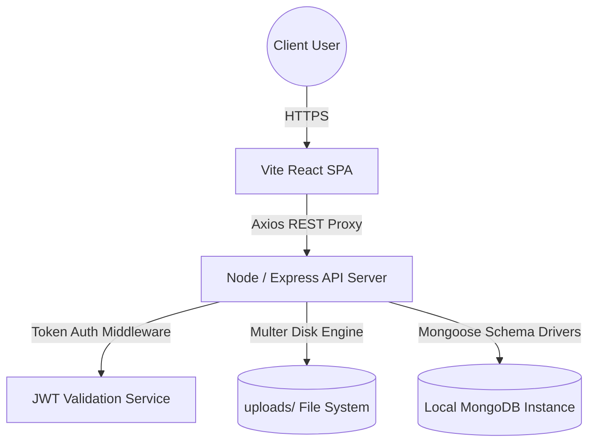
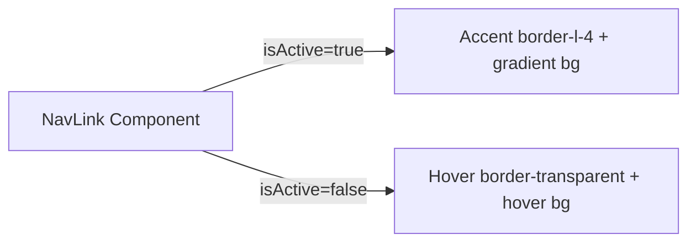
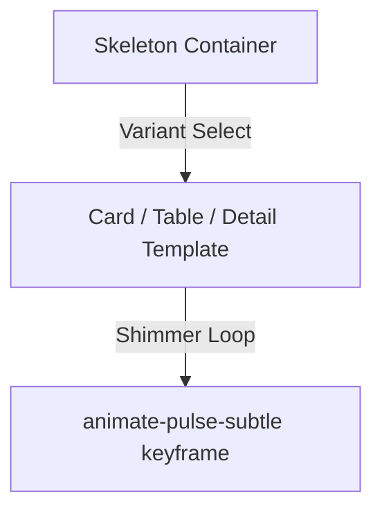
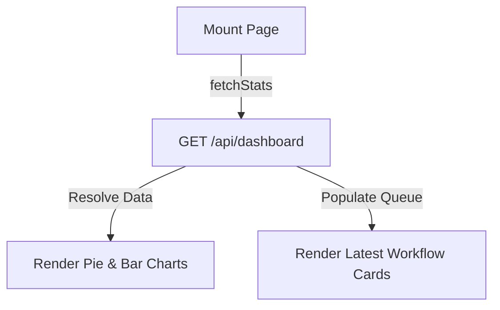
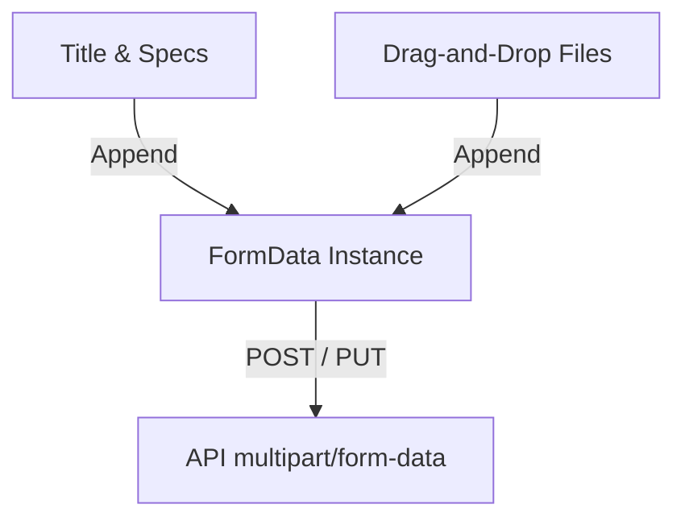
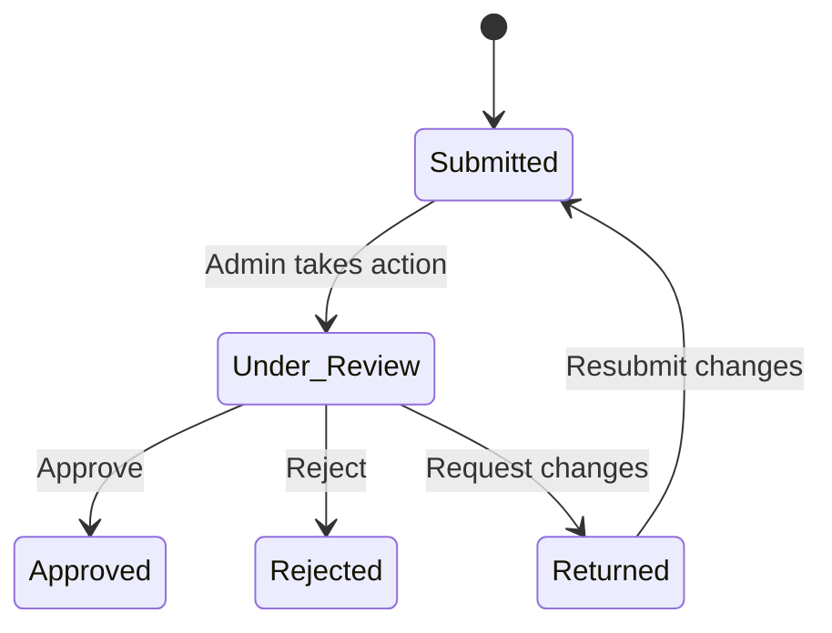

# 🎓 DigitalFile Complete Engineering Slide Deck
## *Master Presentation Suite: Frontend & Backend Deep Dive*

This artifact contains the **Master Technical Presentation Suite** for the **DigitalFile Movement & Approval System**. The slides are organized sequentially into distinct sections, presenting code snippets, architectural flows, logic diagrams, and speaker notes for every single component, page, controller, and model.

---

````carousel
# 🎬 Slide 1: Introduction & Corporate Problem
## The Operational Dilemma of File Tracking

### Project Purpose & Vision
The **DigitalFile** platform establishes a secure, traceable, and state-of-the-art **file routing and document lifecycle system** built specifically to address high-friction bottlenecks in corporate and administrative departments.

### The Corporate Challenge
- **Friction**: Bureaucracy lags behind; paper folders or emails stall on review queues without visual indicators.
- **Auditing Gaps**: Traditional sign-offs fail to keep an immutable history, leading to authorization disputes.
- **Location Obscurity**: Active request stages are difficult to trace, preventing accurate completion estimates.

---
# 🗺️ Slide 2: High-Level System Architecture
## Data Flow & Core Protocols



### Speaker Notes
This slide outlines the **three-tier architecture**. The React Client manages presentation logic. Requests pass to the Node/Express server via an HTTP proxy. The API parses state using token-based authentication and executes CRUD actions on MongoDB.

---
# 🧩 Slide 3: Component Deep-Dive — Navbar
## [Navbar.jsx](file:///c:/Users/VardhanReddyMaram/OneDrive%20-%20CriticalRiver%20Technologies%20Pvt.%20Ltd/Desktop/DigitalFile/frontend/src/components/Navbar.jsx)

### Code Blueprint
```jsx
const Navbar = ({ darkMode, toggleDark }) => {
  const { user, logout } = useAuth();
  const location = useLocation();
  // ...
  return (
    <header className="sticky top-0 z-30 w-full bg-white/75 dark:bg-dark-300/75 backdrop-blur-xl border-b ...">
```

### Component Parameters & State
- **Props**: `darkMode` (boolean state tracking), `toggleDark` (callback to switch colors).
- **Hooks**: `useAuth()` (accesses user metadata), `useLocation()` (inspects paths for dynamic header titles).
- **Interactive Logic**: Renders custom dark mode buttons (sun/moon), profile user badge, and universal search placeholder.

---
# 🧩 Slide 4: Component Deep-Dive — Sidebar
## [Sidebar.jsx](file:///c:/Users/VardhanReddyMaram/OneDrive%20-%20CriticalRiver%20Technologies%20Pvt.%20Ltd/Desktop/DigitalFile/frontend/src/components/Sidebar.jsx)

### Active Navigation Indicator Flow


### Specifications
- **Purpose**: Centralized command navigation bar containing system summaries.
- **Props**: None.
- **Hooks**: `useAuth()` (role-based link filtering), `useState` (mobile sidebar visibility toggle).
- **Render Steps**: Matches authenticated role definitions against `roles: ['admin', 'employee']` lists ➔ Dynamically maps items to screen lists ➔ Details operations status inside the footer.

---
# 🧩 Slide 5: Component Deep-Dive — FileCard
## [FileCard.jsx](file:///c:/Users/VardhanReddyMaram/OneDrive%20-%20CriticalRiver%20Technologies%20Pvt.%20Ltd/Desktop/DigitalFile/frontend/src/components/FileCard.jsx)

### Technical Details
- **Props**: `file` (the Mongoose database file object).
- **Purpose**: Displays metadata tags, description clips, status badges, and details links in a modern card layout.
- **JSX Composition**: Renders a card shell (`card-premium`) ➔ Embeds status badge ➔ Truncates details ➔ Renders author & timestamps ➔ Provides navigation routes to the log details view.

---
# 🧩 Slide 6: Component Deep-Dive — LoadingSkeleton
## [LoadingSkeleton.jsx](file:///c:/Users/VardhanReddyMaram/OneDrive%20-%20CriticalRiver%20Technologies%20Pvt.%20Ltd/Desktop/DigitalFile/frontend/src/components/LoadingSkeleton.jsx)

### Pulse Shimmer Workflow


### Specifications
- **Purpose**: Implements clean pulse loading layouts to improve perceived application performance.
- **Props**: `variant` (`'dashboard' | 'table' | 'cards' | 'detail'`).
- **CSS Variable**: `pulse-subtle` animation transitions opacity from `1.0` to `0.6` smoothly.

---
# 📄 Slide 7: Page-by-Page — DashboardPage
## [DashboardPage.jsx](file:///c:/Users/VardhanReddyMaram/OneDrive%20-%20CriticalRiver%20Technologies%20Pvt.%20Ltd/Desktop/DigitalFile/frontend/src/pages/DashboardPage.jsx)

### Features
- **Route URL**: `/dashboard` (Employee & Admin)
- **Visuals**: Contains the welcome CTA banner, metrics layout, operational stats, Recharts visualizer, and horizontal updates queue.
- **Logic Flow**:


---
# 📄 Slide 8: Page-by-Page — FilesListPage
## [FilesListPage.jsx](file:///c:/Users/VardhanReddyMaram/OneDrive%20-%20CriticalRiver%20Technologies%20Pvt.%20Ltd/Desktop/DigitalFile/frontend/src/pages/FilesListPage.jsx)

### Specifications & Advanced Filters
- **Route URL**: `/files`
- **Components**: `FileCard`, `FileTable`, `LoadingSkeleton`, `EmptyState`, `Pagination`
- **Logic Flow**: Handles debounced title searches ➔ Combines toggles for status filters, urgency filters, and department buttons ➔ Switches view layouts dynamically (cards grid vs spreadsheet rows).

---
# 📄 Slide 9: Page-by-Page — FileFormPage
## [FileFormPage.jsx](file:///c:/Users/VardhanReddyMaram/OneDrive%20-%20CriticalRiver%20Technologies%20Pvt.%20Ltd/Desktop/DigitalFile/frontend/src/pages/FileFormPage.jsx)

### Multipart Attachment Architecture


### Specifications
- **Route URL**: `/files/new` (or `/files/:id/edit`)
- **Features**: Drag-and-drop file uploader (10MB maximum limit), multi-file attachments queue, custom validation alerts.

---
# 📄 Slide 10: Page-by-Page — FileDetailPage
## [FileDetailPage.jsx](file:///c:/Users/VardhanReddyMaram/OneDrive%20-%20CriticalRiver%20Technologies%20Pvt.%20Ltd/Desktop/DigitalFile/frontend/src/pages/FileDetailPage.jsx)

### Workflow Approval State Machine


### Specifications
- **Route URL**: `/files/:id`
- **Visuals**: Timeline maps, details charts, download attachment cells, action logs, modal routing triggers.

---
# ⚙️ Slide 11: Backend Controller — fileController
## [fileController.js](file:///c:/Users/VardhanReddyMaram/OneDrive%20-%20CriticalRiver%20Technologies%20Pvt.%20Ltd/Desktop/DigitalFile/backend/controllers/fileController.js)

### Logic Architecture
- **createFile**: Validates required body properties ➔ Checks for file buffers inside `req.file` ➔ Writes record parameters to DB with an initial `"submitted"` history log.
- **getFiles**: Builds compound query objects ➔ Fetches records with dynamic `populate` calls ➔ Executes concurrent `countDocuments` tasks in the database via `Promise.all` to return clean paginated outputs.

---
# 🛡️ Slide 12: Backend Controller — authController
## [authController.js](file:///c:/Users/VardhanReddyMaram/OneDrive%20-%20CriticalRiver%20Technologies%20Pvt.%20Ltd/Desktop/DigitalFile/backend/controllers/authController.js)

### Security Tokens Lifecycle


### Specifications
- **Endpoints**: `/api/auth/register` (user registration), `/api/auth/login` (email/password check), `/api/auth/me` (profile resolver).
- **Salting Cryptography**: User password hashes are managed safely via `pre('save')` schema triggers.

---
# 📂 Slide 13: Database Models Schema — User
## [User.js](file:///c:/Users/VardhanReddyMaram/OneDrive%20-%20CriticalRiver%20Technologies%20Pvt.%20Ltd/Desktop/DigitalFile/backend/models/User.js)

### Schema Keys & Database Definitions
```javascript
const userSchema = new mongoose.Schema({
  name: { type: String, required: true, trim: true },
  email: { type: String, required: true, unique: true, lowercase: true },
  password: { type: String, required: true, select: false },
  role: { type: String, enum: ['employee', 'admin'], default: 'employee' },
  department: { type: String, default: 'General' }
});
```

### Mongoose Encryption Hooks
Automatically executes password hashing with **12 salt rounds** before committing database saves:
```javascript
userSchema.pre('save', async function (next) {
  if (!this.isModified('password')) return next();
  this.password = await bcrypt.hash(this.password, await bcrypt.genSalt(12));
});
```

---
# 📂 Slide 14: Database Models Schema — File
## [File.js](file:///c:/Users/VardhanReddyMaram/OneDrive%20-%20CriticalRiver%20Technologies%20Pvt.%20Ltd/Desktop/DigitalFile/backend/models/File.js)

### Data Relational Attributes
- **`createdBy`**: Referenced ID pointing to `User` collection.
- **`assignedTo`**: Referenced ID pointing to `User` collection (admin/reviewer).
- **`approvalHistory`**: Array of sub-document logs detailing workflow steps.

### Index Optimizations
```javascript
fileSchema.index({ title: 'text', description: 'text' });
fileSchema.index({ status: 1, department: 1, priority: 1 });
```
Indexes speed up search processes, reducing resource usage.

---
# 🔐 Slide 15: Security, Performance & Code Best Practices
## Enterprise Infrastructure Safeguards

### Authentication & API Security
- **Strict JWT Middleware**: REST requests must pass through token validators to populate `req.user`.
- **Role Guards**: Admin endpoints are locked down with middleware checks (`req.user.role === 'admin'`).
- **NoSQL Injection Block**: Parameter parsing checks protect against database security exploits.

### Optimizations
- **Text Search Indices**: Compound indexes allow efficient queries.
- **Debounced Text Typing**: The React `useDebounce` hook limits API calls.
- **Stateless Sessions**: Stateless tokens remove session lookups from the server.
- **Skeletons**: Pulse loaders improve the overall user experience.
````

---

## Technical Appendix: Developer Q&A Cheat Sheet

Prepare for viva defenses or job interviews with these technical question and answer cards:

````carousel
### 💡 Question 1
**Q: How does the application prevent race conditions or duplicate submissions in the React components?**

**A**: Submitting controls set the state variable `submitting` to `true` inside `handleSubmit` functions immediately. When `submitting === true`, the routing action buttons are disabled (`disabled={submitting}`) and replace visual text with loading skeletons. This blocks subsequent clicks and duplicate API requests during execution.
<!-- slide -->
### 💡 Question 2
**Q: What is the purpose of `Promise.all` inside the file fetching routes?**

**A**: In `getFiles`, the server needs to fetch the list of files matching the query and get the total count of matching files for pagination. Using `await Promise.all([query, count])` starts both DB queries concurrently. This reduces database wait time by up to 50% compared to running them sequentially.
<!-- slide -->
### 💡 Question 3
**Q: How are file attachments managed securely on the disk?**

**A**: Uploads are processed by `multer` inside the backend application tier. Uploaded files are written directly to a local, protected folder (`uploads/`). Filenames are renamed using random hashes and timestamps to prevent filename collisions. They are served statically by Express (`app.use('/uploads', ...)`).
<!-- slide -->
### 💡 Question 4
**Q: How does dark mode toggle smoothly across the entire React application?**

**A**: The `darkMode` state is initialized inside `App.jsx` by checking local storage (`localStorage.getItem('digitalfile_dark')`) or falling back to the user's system preferences (`prefers-color-scheme: dark`). The state toggles the `.dark` class directly on the root element (`document.documentElement`). Tailwind’s `dark:` classes respond instantly.
````
